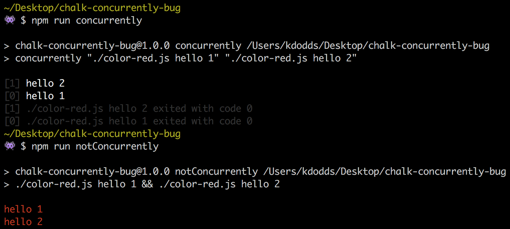

# chalk-concurrently-bug

I'm not getting colorized output when running concurrently on a script that is outputing stuff with chalk.

0. Clone the project: `git clone https://github.com/kentcdodds/chalk-concurrently-bug.git`
1. Install the dependencies: `npm install`
2. Try running the script `npm run concurrently` and you'll notice that the text is not colored
3. Then run the script `npm run notConcurrently` and you'll notice that the text is colored

